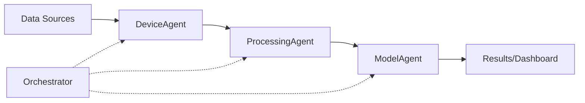

# NeurOS: Neural Operating System

<div align="center">
  
  
  
  
</div>

## The Real-Time Neural Data Platform with Foundation Models

NeurOS is a **comprehensive platform** for neural data processing that bridges classical BCI methods with cutting-edge foundation models. It's designed to be the **DIAMOND standard**: **D**ata-driven, **I**nteroperable, **A**daptive, **M**ulti-modal, **O**pen, **N**eural **D**ecoding platform.

---

## ✨ Key Features

### 🧠 Foundation Models (Unique!)
- **6 State-of-the-Art Models**: POYO+, NDT2/3, CEBRA, Neuroformer
- **Transfer Learning**: Cross-session and cross-subject decoding
- **Zero-Shot & Few-Shot**: Rapid adaptation with minimal data
- **Pretrained Weights**: Load and fine-tune on your data

### ⚡ Real-Time Processing
- Agent-based architecture for asynchronous streaming
- Multi-modal synchronization (EEG, video, audio, sensors)
- Low-latency inference (<10ms typical)
- WebSocket streaming for live dashboards

### 🔧 Comprehensive Toolkit
- **11+ Classical Models**: SVM, Random Forest, EEGNet, LSTM, Transformer
- **15+ Data Drivers**: EEG, fNIRS, EMG, EOG, ECG, motion sensors
- **Signal Processing**: Filtering, artifact removal, feature extraction
- **Data Augmentation**: 8 EEG-specific techniques

### 📊 Standard Formats
- **NWB**: Neurodata Without Borders (read/write)
- **BIDS**: Brain Imaging Data Structure
- Allen Institute datasets
- Public BCI datasets (BNCI, PhysioNet)

---

## 🚀 Quickstart

### Installation

```bash
pip install neuros

# Or with all optional dependencies
pip install neuros[all]
```

### 30-Second Example

```python
from neuros.pipeline import Pipeline
from neuros.foundation_models import CEBRAModel

# Create pipeline with foundation model
pipeline = Pipeline(
    driver='simulated_eeg',
    processor='bandpass_filter',
    model=CEBRAModel(input_dim=64, output_dim=3)
)

# Run and visualize
results = pipeline.run(duration=60)
pipeline.plot_latent_space()
```

---

## 🎯 What Makes NeurOS Different?

| Feature | NeurOS | MNE-Python | BCI2000 | Braindecode |
|---------|--------|------------|---------|-------------|
| Real-time Streaming | ✅ | ❌ | ✅ | ❌ |
| Foundation Models | ✅ | ❌ | ❌ | ❌ |
| Multi-modal Sync | ✅ | ⚠️ | ⚠️ | ❌ |
| Deep Learning | ✅ | ❌ | ❌ | ✅ |
| NWB Support | ✅ | ⚠️ | ❌ | ❌ |
| Transfer Learning | ✅ | ❌ | ❌ | ⚠️ |
| CLI + API | ✅ | ⚠️ | ❌ | ⚠️ |

---

## 📚 Foundation Models Showcase

### POYO+ (Multi-task Decoding)
```python
from neuros.foundation_models import POYOPlusModel

model = POYOPlusModel.from_pretrained('poyo-plus-base')
predictions = model.predict(neural_data)  # Multiple tasks simultaneously
```

### NDT3 (Motor Decoding)
```python
from neuros.foundation_models import NDT3Model

ndt3 = NDT3Model.from_pretrained('ndt3-motor')
motor_output = ndt3.predict(spikes)  # Real-time motor decoding
ndt3.fine_tune(X_new, y_new, subject_id=5)  # Rapid adaptation
```

### CEBRA (Latent Embeddings)
```python
from neuros.foundation_models import CEBRAModel

cebra = CEBRAModel(input_dim=100, output_dim=3, learning_mode='behavior')
embeddings = cebra.fit_transform(neural_data, behavior=behavior_data)
# Produces consistent, interpretable latent spaces
```

### Neuroformer (Zero-Shot Learning)
```python
from neuros.foundation_models import NeuroformerModel

neuroformer = NeuroformerModel.from_pretrained('neuroformer-base')
# Zero-shot prediction without fine-tuning!
predictions = neuroformer.zero_shot_predict(
    data,
    task_description="Classify left vs right arm movement"
)
```

---

## 🏗️ Architecture

NeurOS uses an **agent-based architecture** for flexible, asynchronous processing:



- **DeviceAgent**: Handles data acquisition from various sources
- **ProcessingAgent**: Applies filters, features, augmentation
- **ModelAgent**: Runs inference with classical or foundation models
- **Orchestrator**: Coordinates agents and handles fault tolerance

---

## 📖 Use Cases

### Research
- Cross-subject BCI generalization
- Neural population dynamics analysis
- Behavioral decoding from neural activity
- Multi-modal neuroscience experiments

### Clinical
- Real-time seizure detection
- Motor imagery rehabilitation
- Cognitive state monitoring
- Closed-loop stimulation

### Engineering
- BCI system prototyping
- Algorithm benchmarking
- Hardware integration testing
- Production deployment

---

## 🎓 Getting Help

- **Documentation**: [Full docs here](https://neuros.readthedocs.io)
- **Tutorials**: [Step-by-step guides](tutorials/basic-pipeline.md)
- **API Reference**: [Complete API](api/pipeline.md)
- **Issues**: [GitHub Issues](https://github.com/yourusername/neuros-v1/issues)

---

## 🤝 Contributing

We welcome contributions! See our [Contributing Guide](development/contributing.md) for:
- Code style guidelines
- Testing requirements
- Pull request process
- Development setup

---

## 📊 Status

- **Tests**: 239 passing (100% success rate)
- **Coverage**: >80% (goal: 90%)
- **Models**: 6 foundation + 11 classical
- **DIAMOND Score**: 7/7 (complete compliance)
- **Python**: 3.9, 3.10, 3.11, 3.12, 3.13

---

## 📄 Citation

If you use NeurOS in your research, please cite:

```bibtex
@software{neuros2025,
  title={NeurOS: A Real-Time Neural Data Platform with Foundation Models},
  author={NeurOS Team},
  year={2025},
  url={https://github.com/yourusername/neuros-v1}
}
```

---

## 🏆 Acknowledgments

Built with:
- Foundation model wrappers for POYO+, NDT, CEBRA, Neuroformer
- Integration with Allen Institute datasets
- Support for TorchBrain and TemporalData
- Community-driven development

---

## ⚡ Quick Links

<div class="grid cards" markdown>

-   :material-clock-fast:{ .lg .middle } __Getting Started__

    ---

    Install NeurOS and run your first pipeline in 5 minutes

    [:octicons-arrow-right-24: Installation](getting-started/installation.md)

-   :material-brain:{ .lg .middle } __Foundation Models__

    ---

    Learn how to use state-of-the-art neural decoding models

    [:octicons-arrow-right-24: Foundation Models Guide](user-guide/foundation-models.md)

-   :material-book-open-variant:{ .lg .middle } __Tutorials__

    ---

    Step-by-step guides for common tasks and workflows

    [:octicons-arrow-right-24: View Tutorials](tutorials/basic-pipeline.md)

-   :material-api:{ .lg .middle } __API Reference__

    ---

    Complete documentation of all classes and functions

    [:octicons-arrow-right-24: API Docs](api/pipeline.md)

</div>

---

**Ready to get started?** Check out the [Installation Guide](getting-started/installation.md) or jump to [Quickstart](getting-started/quickstart.md)!
