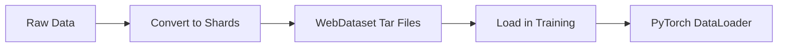

# WebDataset Quick Reference

## Installation

No additional dependencies needed - uses standard PyTorch and NumPy.

## Basic Workflow



## 1-Minute Quick Start

### Create Shards

```python
from neuros_neurofm.datasets import create_shards_from_arrays
import numpy as np

data = {
    "spikes": np.random.randn(10000, 100, 96),
    "behavior": np.random.randn(10000, 100, 2),
}

create_shards_from_arrays("./shards", data, shard_size=1000)
```

### Load in Training

```python
from neuros_neurofm.datasets import create_webdataset_dataloader

train_loader = create_webdataset_dataloader(
    shard_dir="./shards",
    batch_size=32,
    num_workers=4,
)

for batch in train_loader:
    spikes = batch["spikes"]
    # ... training code ...
```

## Common Commands

### CLI Conversion

```bash
# NWB files
python scripts/convert_to_shards.py -i data/*.nwb -o ./shards --workers 8

# NPZ file
python scripts/convert_to_shards.py -i data.npz -o ./shards

# With validation
python scripts/convert_to_shards.py -i data/*.nwb -o ./shards --validate
```

### Programmatic Conversion

```python
# From NWB
from neuros_neurofm.datasets import NWBToWebDatasetConverter

converter = NWBToWebDatasetConverter("./shards", shard_size=1000)
converter.convert_nwb_files(["file1.nwb", "file2.nwb"])
converter.finalize()

# From arrays
from neuros_neurofm.datasets import WebDatasetWriter

writer = WebDatasetWriter("./shards", shard_size=1000)
for sample in my_data:
    writer.write_sample(sample)
writer.finalize()
```

### Loading Options

```python
# Basic
loader = WebDatasetLoader("./shards")

# With resumption
loader = ResumableWebDatasetLoader(
    shard_dir="./shards",
    checkpoint_path="./checkpoint.json",
)

# Full DataLoader
loader = create_webdataset_dataloader(
    shard_dir="./shards",
    batch_size=32,
    num_workers=4,
    shuffle=True,
)
```

## Key Parameters

### Writer

| Parameter | Default | Description |
|-----------|---------|-------------|
| `shard_size` | 1000 | Samples per shard |
| `compression` | "none" | Compression: none/gz/bz2/xz |
| `shard_name_pattern` | "shard_{shard_idx:06d}.tar" | Shard naming |

### Loader

| Parameter | Default | Description |
|-----------|---------|-------------|
| `shuffle` | True | Shuffle samples |
| `buffer_size` | 1000 | Shuffle buffer size |
| `num_workers` | 4 | Data loading workers |
| `batch_size` | 32 | Batch size |
| `prefetch_factor` | 2 | Batches to prefetch |

## File Structure

```
output_dir/
├── shard_000000.tar          # First shard
├── shard_000001.tar          # Second shard
├── ...
└── dataset_metadata.json     # Global metadata
```

Each shard contains:
```
shard_000000.tar:
├── sample_000000001.spikes.pyd
├── sample_000000001.behavior.pyd
├── sample_000000001.metadata.json
├── ...
```

## Code Snippets

### Full Training Example

```python
from neuros_neurofm.datasets import create_webdataset_dataloader
from neuros_neurofm.models import NeuroFMX
import torch

# Data
train_loader = create_webdataset_dataloader(
    "./train_shards", batch_size=32, num_workers=4
)

# Model
model = NeuroFMX(input_dim=96, hidden_dim=256, n_layers=8)
optimizer = torch.optim.Adam(model.parameters())

# Train
for epoch in range(10):
    for batch in train_loader:
        output = model(batch["spikes"])
        loss = criterion(output, batch["behavior"])

        optimizer.zero_grad()
        loss.backward()
        optimizer.step()
```

### Inspect Shards

```python
from neuros_neurofm.datasets import ShardedDatasetInfo

info = ShardedDatasetInfo("./shards")
info.print_summary()

summary = info.get_summary()
print(f"Samples: {summary['total_samples']}")
print(f"Shards: {summary['total_shards']}")
```

### Resume from Checkpoint

```python
from neuros_neurofm.datasets import ResumableWebDatasetLoader

# First run
loader = ResumableWebDatasetLoader(
    shard_dir="./shards",
    checkpoint_path="./checkpoint.json",
    checkpoint_interval=1000,
)

for sample in loader:
    # ... training ...
    # Automatically checkpoints every 1000 samples

# After interruption - automatically resumes
loader = ResumableWebDatasetLoader(
    shard_dir="./shards",
    checkpoint_path="./checkpoint.json",
)
# Continues from last checkpoint
```

### Custom Metadata

```python
writer = WebDatasetWriter("./shards")

for trial in trials:
    sample = {
        "spikes": trial.spikes,
        "behavior": trial.behavior,
    }

    metadata = {
        "trial_id": trial.id,
        "condition": trial.condition,
        "subject": trial.subject,
        "timestamp": trial.timestamp,
    }

    writer.write_sample(sample, metadata=metadata)

writer.finalize()
```

## Performance Tips

| Scenario | Recommendation |
|----------|----------------|
| Small dataset (<10K samples) | `shard_size=500`, `num_workers=2` |
| Medium dataset (10K-100K) | `shard_size=1000`, `num_workers=4` |
| Large dataset (>100K) | `shard_size=2000`, `num_workers=8` |
| Limited RAM | Reduce `buffer_size`, `prefetch_factor` |
| SSD storage | Increase `num_workers`, `prefetch_factor` |
| HDD storage | Use compression, fewer workers |

## Troubleshooting

| Problem | Solution |
|---------|----------|
| Slow loading | Increase `num_workers`, use SSD |
| Out of memory | Reduce `batch_size`, `buffer_size` |
| Worker crashes | Reduce `num_workers`, check RAM |
| No shuffling | Set `shuffle=True`, increase `buffer_size` |
| Can't find shards | Check `shard_dir` path, glob pattern |

## API Quick Lookup

### Import Statements

```python
from neuros_neurofm.datasets import (
    # Writers
    WebDatasetWriter,
    NWBToWebDatasetConverter,
    create_shards_from_arrays,

    # Loaders
    WebDatasetLoader,
    ResumableWebDatasetLoader,
    create_webdataset_dataloader,

    # Utils
    ShardedDatasetInfo,
    collate_webdataset,
)
```

### Common Patterns

```python
# Pattern 1: Simple conversion + loading
create_shards_from_arrays("./shards", data_dict)
loader = create_webdataset_dataloader("./shards", batch_size=32)

# Pattern 2: NWB conversion
converter = NWBToWebDatasetConverter("./shards")
converter.convert_nwb_files(nwb_files)
converter.finalize()

# Pattern 3: Production training with resumption
loader = ResumableWebDatasetLoader(
    "./shards",
    checkpoint_path="./ckpt.json",
    checkpoint_interval=1000,
)
```

## See Also

- Full guide: `docs/WEBDATASET_GUIDE.md`
- Examples: `examples/webdataset_example.py`
- Tests: `tests/test_webdataset.py`
- CLI tool: `scripts/convert_to_shards.py`
